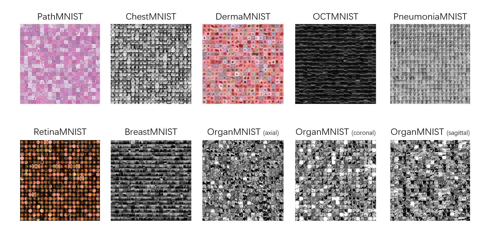

# MedMNIST 
## Project Page ([Website](https://medmnist.github.io/)) | Paper ([ISBI'21](https://arxiv.org/abs/2010.14925)) | Dataset ([Zenodo](https://doi.org/10.5281/zenodo.4269852))
[Jiancheng Yang](https://jiancheng-yang.com/), Rui Shi, [Bingbing Ni](https://scholar.google.com/citations?user=eUbmKwYAAAAJ)

We present *MedMNIST*, a collection of 10 pre-processed medical open datasets. MedMNIST is standardized to perform classification tasks on lightweight 28 × 28 images, which requires no background knowledge. Covering the primary data modalities in medical image analysis, it is diverse on data scale (from 100 to 100,000) and tasks (binary/multi-class, ordinal regression and multi-label). MedMNIST could be used for educational purpose, rapid prototyping, multi-modal machine learning or AutoML in medical image analysis. Moreover, MedMNIST Classification Decathlon is designed to benchmark AutoML algorithms on all 10 datasets. 

For more details, please refer to our paper:

**MedMNIST Classification Decathlon: A Lightweight AutoML Benchmark for Medical Image Analysis** ([ISBI'21](https://arxiv.org/abs/2010.14925))

# Key Features
* ***Educational***: Our multi-modal data, from multiple open medical image datasets with Creative Commons (CC) Licenses, is easy to use for educational purpose.
* ***Standardized***: Data is pre-processed into same format, which requires no background knowledge for users.
* ***Diverse***: The multi-modal datasets covers diverse data scales (from 100 to 100,000) and tasks (binary/multiclass, ordinal regression and multi-label).
* ***Lightweight***: The small size of 28 × 28 is friendly for rapid prototyping and experimenting multi-modal machine learning and AutoML algorithms.

Please note that this dataset is **NOT** intended for clinical use.

# Code Structure
* [`medmnist/`](medmnist/):
    * [`dataset.py`](medmnist/dataset.py): PyTorch datasets and dataloaders of MedMNIST.
    * [`evaluator.py`](medmnist/evaluator.py): Standardized evaluation functions.
    * [`info.py`](medmnist/info.py): Dataset information `dict` for each subset of MedMNIST.
* [`examples/`](examples/):
    * [`getting_started.ipynb`](examples/getting_started.ipynb): Explore the MedMNIST dataset with jupyter notebook. It is **ONLY** intended for a quick exploration, i.e., it does not provide full training and evaluation functionalities. Please refer to our another repository [`MedMNIST/experiments`](https://github.com/MedMNIST/experiments) for all experiments, including PyTorch, auto-sklearn, AutoKeras and Google AutoML Vision, together with their weights!
    * #TODO [`getting_started_without_PyTorch.ipynb`](examples/getting_started_without_PyTorch.ipynb): This notebook provides snippets about how to use MedMNIST data (the `.npz` files) without PyTorch.
* [`setup.py`](setup.py): The script to install medmnist as a module

# Installation and Requirements
Setup the required environments and install `medmnist` as a standard Python package:

    pip install --upgrade git+https://github.com/MedMNIST/MedMNIST.git

Check whether you have isnstalled the latest [version](medmnist/info.py):

    >>> import medmnist
    >>> print(medmnist.__version__)

The code requires only common Python environments for machine learning. Basicially, it was tested with
* Python 3 (Anaconda 3.6.3 specifically)
* PyTorch\==0.3.1
* numpy\==1.18.5, pandas\==0.25.3, scikit-learn\==0.22.2, Pillow\==8.0.1, fire

Higher (or lower) versions should also work (perhaps with minor modifications). 

It is suggested to use our PyTorch [`dataset`](medmnist/dataset.py) code to parse the `.npz` files; However, you are free to parse them with your own code (without PyTorch or even without Python!), as they are only standard NumPy serialization files. Please refer to [`getting_started_without_PyTorch.ipynb`](examples/getting_started_without_PyTorch.ipynb), which provides snippets about how to use MedMNIST data (the `.npz` files) without PyTorch.

# Dataset

Please download the dataset(s) via [`Zenodo`](https://doi.org/10.5281/zenodo.4269852). You could also use our code to download automatically.

The MedMNIST dataset contains several subsets. Each subset (e.g., `pathmnist.npz`) is comprised of 6 keys: `train_images`, `train_labels`, `val_images`, `val_labels`, `test_images` and `test_labels`.
* `train_images` / `val_images` / `test_images`: `N` x 28 x 28 x 3 for RGB,  `N` x 28 x 28 for gray-scale. `N` denotes the number of samples.  
* `train_labels` / `val_labels` / `test_labels`: `N` x `L`. `N` denotes the number of samples. `L` denotes the number of task labels; for single-label (binary/multi-class) classification, `L=1`, and `{0,1,2,3,..,C}` denotes the category labels (`C=1` for binary); for multi-label classification `L!=1`, e.g., `L=14` for `chestmnist.npz`.

# How to Use

* List all available datasets:
    
        python -m medmnist available

* Download all available datasets:
    
        python -m medmnist download

* Delete all downloaded npz from root:

        python -m medmnist clean

* Print the dataset details given a subset flag:

        python -m medmnist info --flag=xxxmnist

* Save the dataset as standard figure and csv files, which could be used for AutoML tools, e.g., Google AutoML Vision:

        python -m medmnist save --flag=xxxmnist --folder=tmp/

* Parse and evaluate a standard result file, refer to [`Evaluator.parse_and_evaluate`](medmnist/evaluator.py) for details.

        python -m medmnist evaluate --path=folder/{flag}_{split}@{run}.csv

* Download the dataset manually or automatically (by setting `download=True` in [`dataset.py`](medmnist/dataset.py)).

* Explore the MedMNIST dataset with jupyter notebook ([`getting_started.ipynb`](examples/getting_started.ipynb)), and train basic neural networks in PyTorch.

* If you do not use PyTorch, go to [`getting_started_without_PyTorch.ipynb`](examples/getting_started_without_PyTorch.ipynb), which provides snippets about how to use MedMNIST data (the `.npz` files) without PyTorch.

* Please refer to our another repository [`MedMNIST/experiments`](https://github.com/MedMNIST/experiments) for all experiments, including PyTorch, auto-sklearn, AutoKeras and Google AutoML Vision together with their weights!

# Citation

If you find this project useful, please cite our paper as:

    Jiancheng Yang, Rui Shi, Bingbing Ni. "MedMNIST Classification Decathlon: A Lightweight AutoML Benchmark for Medical Image Analysis," IEEE 18th International Symposium on Biomedical Imaging (ISBI), 2021.

or using the bibtex:
     
    @inproceedings{medmnistv1,
        title={MedMNIST Classification Decathlon: A Lightweight AutoML Benchmark for Medical Image Analysis},
        author={Yang, Jiancheng and Shi, Rui and Ni, Bingbing},
        booktitle={IEEE 18th International Symposium on Biomedical Imaging (ISBI)},
        pages={191--195},
        year={2021}
    }

Please also cite the corresponding paper of source data if you use any subset of MedMNIST as per the description in the [project page](https://medmnist.github.io/).

# LICENSE

The code is under Apache-2.0 License.

The datasets are under Creative Commons (CC) Licenses in general. Each subset uses the same license as that of the source dataset, please refer to the [project page](https://medmnist.github.io/) for details. 
